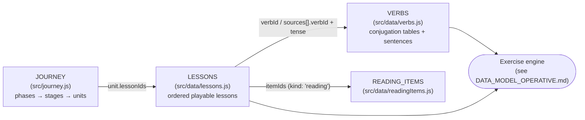

# Aditzak — Academic Data Model

This document explains the **academic** half of the app's data model: the
hand-written curriculum data shipped with the app — the Basque verb
conjugations, the lessons that drill them, the journey roadmap that orders
them, and the reading-comprehension items. There is no database; the
curriculum *is* the source code.

The **operative** half — runtime question objects, persisted learner state
(progress, streak, points, errors, hearts), and cloud sync — is documented
separately in `docs/technical/DATA_MODEL_OPERATIVE.md`.

This is a map, not a spec — the authoritative shape documentation lives as
comments at the top of each data file (especially `src/data/verbs.js`,
`src/data/lessons.js`, and `src/journey.js`), and this doc points into them.



---

## 1. Verb data — `VERBS` (`src/data/verbs.js`)

The linguistic source of truth: an array of verb entries, one per verb (or per
fixed verb+particle construction like `hitz-egin` or `ados-egon`). The file's
~290-line header comment is the canonical field-by-field reference; the
summary:

### Identity and classification

| Field | Meaning |
|---|---|
| `id` | Stable key referenced by `LESSONS` (`verbId`), e.g. `'izan'`, `'bizi-izan'`. |
| `verb` | The citation form shown in the UI. |
| `meaning` | `{ en, es, eu }` gloss (the app UI is trilingual). |
| `type` | `'synthetic'` (conjugated directly, *aditz trinkoa*) vs `'periphrastic'` (participle + auxiliary). Drives `TypeBadge`. |
| `agreement` | Which arguments the finite form marks: subset of `['nor', 'nori', 'nork']` (absolutive / dative / ergative — the NOR-NORI-NORK system). Drives `AgreementBadge` and distractor-lure eligibility. |
| `dialect` | Always `'batua'` today; placeholder for future `dialectVariants` overrides. |
| `personAxis` | `'nor'` (default) \| `'nork'` \| `'nori'` — which case role the person keys of `conjugations[tense]` range over. The keys are always the abstract `ni`/`zu`/`hura`/…, but for `izan` they mean the absolutive subject (*ni naiz*), for `ukan` the ergative subject (*nik dut*), for `gustatu` the dative experiencer (*niri … zait*). Pronoun display resolves through `PRONOUN_DECLENSIONS` + `personPronoun(verb, person)`. |

### Fixed arguments (collapsing multi-argument paradigms to one axis)

A conjugation table is keyed by a *single* person axis, so verbs that agree
with more than one argument fix the other one:

- `object: 'hura'` — a NOR-NORK verb's citation paradigm fixes the absolutive
  object to third-person-singular ("it/him/her"); reused for NOR-NORI
  dative-subject verbs (`gustatu`), where `nor` is fixed and `person` ranges
  over `nori`.
- `recipient` / `agent` — NOR-NORI-NORK (ditransitive) verbs are genuinely 2D
  (NORK × NORI); exactly one of these fixes one axis so `person` varies over
  the other (e.g. `recipient: 'hura'` → *diot/diozu/dio…*).

`getFixedArgument` (`src/lessonLogic.js`) resolves any of these into a uniform
`{ role, person }` for the UI (`FixedArgumentBadge`).

### Conjugation tables

`conjugations` is nested `tense → person → form`:

```js
conjugations: {
  present: { ni: 'naiz', hi: 'haiz', zu: 'zara', hura: 'da', gu: 'gara', zuek: 'zarete', haiek: 'dira' },
  past:    { ni: 'nintzen', ... },
  ...
}
```

"Tense" keys are really *paradigm* keys, not just tenses. Beyond
`present`/`past`/`future` there are: `presentPerfect`, `potential`,
`baldintza`/`conditional`, imperative, allocutive registers
(`presentToka`/`presentNoka`/…), plural-object slices
(`presentPlural`/`pastPlural`/`futurePlural` — the `haiek`-object column, e.g.
*ditut* vs *dut*), and NOR-NORI slices (`presentByNori`, …). `TENSE_META`
(same file) is the registry of display labels/styles per key. Person keys may
be a subset (imperative is 2nd-person-only; toka/noka only `hura`/`haiek`;
`hi` is often absent), and tables can be 3-person or 6-person depending on how
far the curriculum has expanded that verb.

**2D tables.** Two shapes break the flat `person → form` rule, both consumed
only through resolvers in `lessonLogic.js` so downstream code always sees a
flat table:

- `presentByObject`/`pastByObject` — NOR-NORK object-axis grids,
  `{ [nork]: { [nor]: form } }` (e.g. *zaitut* "I …you"). A lesson opts in via
  `objectAxis: { vary, fixed }`, resolved by `resolveObjectAxisTable`.
- `…ByNor` NOR-NORI mirrors (`dativeIzanByNor`), same idea for the dative
  family.

**Composed tables.** Periphrastic forms are `<verb-specific prefix> + <shared
auxiliary cell>`, so the auxiliary grids are stored once in
`OBJECT_AXIS_SKELETONS` (top of `verbs.js`) — `edun` (the transitive
auxiliary) and `dativeIzan`/`dativeIzanByNor` (the dative-intransitive
auxiliary) — and composed at runtime by `getComposedTable` /
`getByNoriComposedTable` (`lessonLogic.js`) from per-verb prefix maps:

- `byObjectPrefixes: { present, past }` — composes the 2D object-axis grids
  (`ikusi.presentByObject.ni.zu` = `'ikusten ' + edun.present.ni.zu`).
- `composedPrefixes: { present, past, future }` — composes the six flat
  singular/plural-object tables for verbs verified to follow the pattern
  exactly (deliberately a separate field from `byObjectPrefixes`; see the
  header comment for why they must not be conflated).
- `byNoriPrefixes` — same mechanism for the NOR-NORI family (`gustatu` etc.).

`ukan` itself carries empty prefixes / literal tables (it *is* the auxiliary,
plus extra `hi` cells the skeleton omits).

### Example-sentence data

Three optional parallel structures, each nested `tense → person`, power the
sentence-based question kinds:

- `sentences` — affirmative "complete the sentence" data. Each person maps to
  one variant or an array of variants; a variant is
  `{ text, validFor, wordOrderSafe?, baseVerb? }` where `text` contains `___`
  marking the blank and `validFor` lists *sibling verb ids whose same-person
  form would also correctly complete that exact sentence* — the tag that
  governs whether a cross-verb distractor may appear against this sentence
  (schema: `docs/academic/SENTENCE_FRAMES.md`; strategy: `docs/academic/DISTRACTOR_STRATEGY.md`).
  `wordOrderSafe: true` opts a sentence into the word-order question kind
  (fail-closed — see `docs/technical/EXERCISE_ENGINE.md`); `baseVerb` tags `ari`
  sentences with the embedded participle's verb for the progressive-vs-plain
  lure.
- `pronounSentences` — the blank is the declined *pronoun* instead of the verb
  form (answer comes from `PRONOUN_DECLENSIONS[verb.personAxis]`).
- `negativeSentences` — negative word order (*Ni ez ___ irakaslea.*); only on
  verbs whose finite form survives negation as a single word. Used only when a
  lesson sets `negation: true`.

`src/validfor-audit.test.js` cross-audits `validFor` tags against the actual
conjugation tables.

### Behaviour flags (all optional)

- `recognitionOnly` — never drill this verb for production (typing,
  spot-the-error), even inside a mixed production pool. Per-verb counterpart
  of a lesson's `mode: 'recognition'`.
- `dativeOvergeneration` — NOR-NORK verbs that commonly take an optional
  dative in real usage; enables the "phantom dative" lure
  (`getDativeOvergenerationLure`).
- `animateObject` (default `true`) — whether the varying object slot of a
  composed axis table may be a person; `false` (thing-only verbs like
  `irakurri`) prunes non-3rd-person `nor` cells.

### Display metadata tables

Also exported from `verbs.js`, and extended (never bypassed) when adding
labels/styles: `TYPE_META`, `AGREEMENT_META`, `TENSE_META`, `DIALECT_LABELS`,
`PERSON_LABEL_KEYS`, `PRONOUN_DECLENSIONS`. The badge components in
`src/components/badges.jsx` are lookups into these.

---

## 2. Lessons — `LESSONS` (`src/data/lessons.js`)

A flat, **ordered** array of the currently-playable lessons. Order matters:
`getUnlockedLessonIds` (`src/lessonLogic.js`) unlocks lessons strictly in
array order (a lesson unlocks once the previous one has ≥1 attempt; the first
is always unlocked; gate and bonus lessons modify this — see §3).

Lesson shapes:

```js
// Practice lesson — one verb, one tense/paradigm:
{ id: 'izan-present', verbId: 'izan', tense: 'present', persons: PHASE_1_PERSONS }

// Pooled lesson — one grammatical pattern across many verbs
// (sources, but NOT review: true):
{ id: 'unit-10-present', persons: [...], sources: [{ verbId: 'jan', tense: 'present' }, ...] }

// Review lesson — consolidation; skips the no-typing ramp and the preview:
{ id: 'unit-1-review', review: true, persons: [...], sources: [{ verbId, tense }, ...] }

// Reading lesson — comprehension items instead of conjugation drills:
{ id: 'unit-36-reading', review: true, kind: 'reading', mode: 'recognition',
  itemIds: ['reading-nor-shift-ireki', ...] }
```

Optional modifier fields, composable on any of the above:

| Field | Effect |
|---|---|
| `persons` | Restricts which grammatical persons are drilled. App-wide rule: **never more than 3 persons per exercise** — `PHASE_1_PERSONS` (`ni/zu/hura`) and `PHASE_1_PLURAL_PERSONS` (`gu/zuek/haiek`) are the two standard filters, which is also why 6-person tables get a `-plural` sibling lesson. |
| `negation` | Passes `includeNegation` to `generateQuestions` — questions come from `negativeSentences` (the `negative`/`type-negative` kinds). |
| `mode: 'recognition'` | No production questions (no typing) for every source in the lesson. |
| `objectAxis: { vary, fixed }` | Reads the source's 2D by-object table, fixing one axis (e.g. `{ vary: 'nor', fixed: 'ni' }` drills *nauzu/nau/naute…*). |
| `kind: 'reading'` | Questions come from `READING_ITEMS` via `itemIds` instead of conjugation tables. |

Review lessons additionally pull **weak-spot questions**: up to
`EXTRA_REVIEW_EXERCISES` extra questions targeting the learner's most-missed
`verbId:tense:person` combinations among that review's own `sources` (see
`getWeakSpotQuestions` and the error-stats store in
`docs/technical/DATA_MODEL_OPERATIVE.md` §2).

---

## 3. Curriculum roadmap — `JOURNEY` (`src/journey.js`)

The presentation/grouping layer over `LESSONS`, mirroring
`docs/academic/LEARNING_JOURNEY.md`: an array of **phases**, each with `id`, `title`,
`subtitle`, and `stages`; each stage has `id`, `title`, and `units`; each unit
is:

```js
{
  number: 2,
  title: 'ukan — The Ergative Leap',
  focus: '…one-paragraph pedagogical focus…',
  payload: '"I have a car." (Nik auto bat dut.)',
  status: 'available' | 'pending',
  lessonIds: ['ukan-present', 'ukan-ni-nik-shift-review', 'unit-2-review'], // available units only
  gate: true,   // optional — Refresh Gate unit
  bonus: true,  // optional — off-spine bonus unit
}
```

- `status: 'pending'` units render as locked "coming soon" roadmap cards from
  `title`/`focus`/`payload` alone — the full curriculum is visible from day
  one. Moving a unit to `available` means: add its lessons to `LESSONS`, flip
  `status`, set `lessonIds`.
- Every available unit's `lessonIds` ends with a `review: true` lesson — its
  consolidation pass.
- `gate: true` marks Refresh Gate units. Two derived sets feed the unlock
  logic: `GATE_LESSON_IDS` (each gate unit's final lesson — must be passed
  with ≥ `GATE_PASS_STARS` stars to proceed) and `BONUS_LESSON_IDS` (every
  lesson of a `bonus: true` unit — reachable from the spine point it branches
  from, but never required to advance).

Translated phase/stage/unit copy lives in
`src/i18n/journeyTranslations.js`, resolved via `journeyText`
(`src/lessonDisplay.js`).

**Integrity contract:** `VERBS` + `LESSONS` + `JOURNEY` form a self-contained
trio with no UI dependency. `src/journey.test.js` cross-checks it — every
`lessonIds` entry resolves to a `LESSONS` id and vice versa (each referenced
exactly once), and every lesson's `verbId`/`tense`/`persons` resolves into
`VERBS`. Run `npm test` after any change to the trio.

---

## 4. Reading items — `READING_ITEMS` (`src/data/readingItems.js`)

Standalone comprehension items for `kind: 'reading'` lessons:

```js
{
  id: 'reading-nor-shift-ireki',
  source: 'Nik atea ireki dut.',        // Basque sentence the learner reads
  gloss:  { en, es, eu },               // translation aid (eu repeats source verbatim)
  prompt: { en, es, eu },               // the comprehension question
  options: ['Atea ireki da.', ...],     // four candidate Basque sentences
  answer: 'Atea ireki da.',
}
```

Referenced from lessons by `itemIds`; turned into questions by
`generateReadingQuestions` (`lessonLogic.js`).

---

## 5. Where the boundaries are

- **UI never hardcodes linguistic labels** — it goes through the `*_META`
  lookup tables (§1) and the i18n layer.
- **Curriculum changes never touch UI code** — the `VERBS`/`LESSONS`/`JOURNEY`
  trio plus `docs/academic/LEARNING_JOURNEY.md` and `src/i18n/journeyTranslations.js`
  are the whole edit surface (see CLAUDE.md, "Working on the learning
  journey").
- **2D/composed conjugation shapes never leak** — `getComposedTable` /
  `resolveObjectAxisTable` flatten them before options, lures, or sentences
  see them.

Related reading: `docs/technical/DATA_MODEL_OPERATIVE.md` (the operative half of the
data model), `docs/academic/CONJUGATIONS.md` (the grammar the tables encode),
`docs/academic/SENTENCE_FRAMES.md` (`validFor` schema), `docs/academic/DISTRACTOR_STRATEGY.md`,
`docs/technical/EXERCISE_ENGINE.md`, `docs/academic/LEARNING_JOURNEY.md`.
